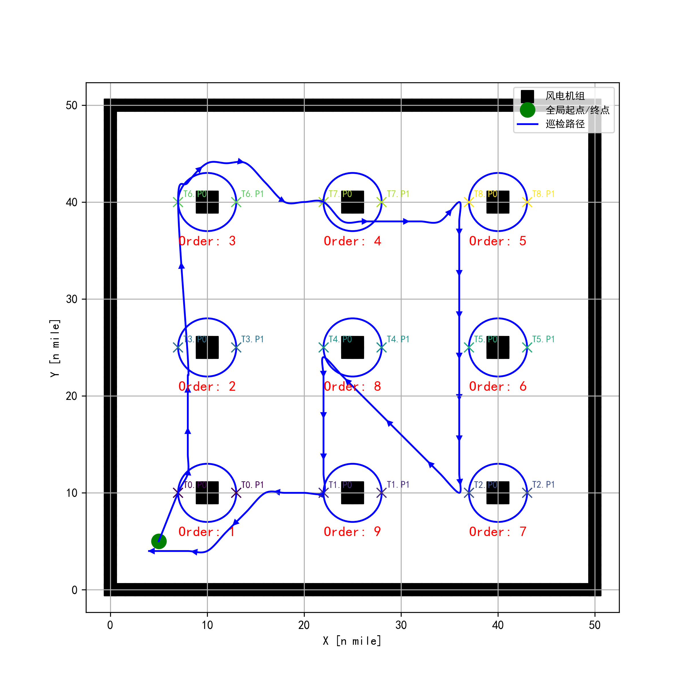

# 风电场巡检路径规划 (TSP + A*)


该模块使用分层规划思路解决风电场的多风机巡检路径问题：
- 上层使用 TSP（旅行商问题）确定风机访问顺序（每台风机仅选取一个巡检点参与排序）；
- 下层使用 A* 栅格搜索规划各段连接路径；
- 可选用三次贝塞尔曲线对整条路径进行平滑，提升可读性与可执行性。

### 演示 (Demo)

运行脚本后会生成最终路径示意图：



> 图中展示了风机分布、TSP 访问顺序标注以及最终巡检路径（平滑后）。

### 主要特性 (Features)

- **分层规划**: TSP 决定风机访问顺序，A* 负责段路径规划。
- **A***: 基于栅格的 A* 搜索，支持障碍物与边界，含基础鲁棒性处理（最大迭代、失败时直连）。
- **多风机布局支持**: 提供多种风机布局示例（矩形、圆形、扇形、椭圆、线形等），可按需切换或自定义。
- **路径平滑**: 三次贝塞尔曲线对 A* 结果路径进行平滑采样。
- **结果可视化**: 绘制障碍物（风机）、巡检点、访问顺序、完整巡检路径并导出 PNG。

### 文件结构 (Files)

- `TSP+A_star.py`: 主程序，包含 A* 实现、TSP 排序与综合可视化。

### 如何使用 (Usage)

直接运行：

```bash
python TSP+A_star.py
```

运行后在当前目录生成 `hierarchical_path_planning_result.png`，并弹出绘图窗口展示最终路径。

### 关键组件 (Key Components)

- **`AStarPlanner`**:
  - `planning(sx, sy, gx, gy)`: 规划从起点到终点的栅格路径，返回 `rx, ry`。
  - 核心方法：`calc_obstacle_map`, `verify_node`, `calc_final_path`, `get_motion_model`。
- **TSP 相关**:
  - `solve_tsp_for_turbines(global_start_point, chosen_turbine_nodes, a_star_planner)`：枚举法解 TSP，输出最优风机访问顺序及段路径缓存。
  - 仅使用每台风机的“选定巡检点”作为 TSP 节点，风机内部路径视作 0。
- **路径平滑**:
  - `smooth_path_with_bezier(path_xy, tangent_scale_factor, num_samples_per_segment)`：对路径进行三次贝塞尔平滑。

### 配置与自定义 (Configuration)

在 `main()` 内可修改：

- **网格/机器人参数**:
  - `grid_size = 2.0`、`robot_radius = 1.5`
- **地图与边界**:
  - 地图尺寸、边界点密度；障碍物（风机）以点云形式写入 `ox/oy`
- **风机布局**:
  - 内置多种布局示例（默认启用矩形/正方形排列），可切换其他形状代码块：
    - 矩形/圆形/扇形/椭圆/线形等
  - 每台风机自动生成两个巡检点（默认取第一个点参与 TSP）
- **平滑参数**:
  - `tangent_scale_factor=0.33`、`num_samples_per_segment=15`
- **显示与导出**:
  - `show_animation=False`（A* 过程）、`show_final_plot=True`（最终图）

示例（片段）：

```python
# 网格与半径
grid_size = 2.0
robot_radius = 1.5

# 全局起终点
global_start_point = (5.0, 5.0)

# 选择“矩形/正方形”排列风机
a = []  # 请参考源码中形状切换的注释块

# 平滑参数
smoothed_path_xy = smooth_path_with_bezier(original_path_xy, tangent_scale_factor=0.33, num_samples_per_segment=15)
```

### 输出 (Outputs)

- `hierarchical_path_planning_result.png`: 包含风机分布、巡检点、TSP 顺序标注与最终巡检路径的图像。
- 终端日志：包含 TSP 顺序、各段路径规划信息以及总路径长度等。

### 依赖 (Dependencies)

- `numpy`, `matplotlib`

安装示例：

```bash
pip install numpy matplotlib
```

### 注意事项 (Notes)

- TSP 采用全排列枚举，适合风机数量较少的实验；数量较多时请替换为启发式或优化算法。
- A* 的障碍物是基于风机点云与安全半径构建的栅格占用图，需根据实际尺度调整 `grid_size` 与 `robot_radius`。
- 当 A* 搜索失败或迭代过多时，退化为直线连接（并打印警告）。

### 许可证 (License)

本项目遵循 MIT 许可协议。欢迎提交改进与扩展。 
